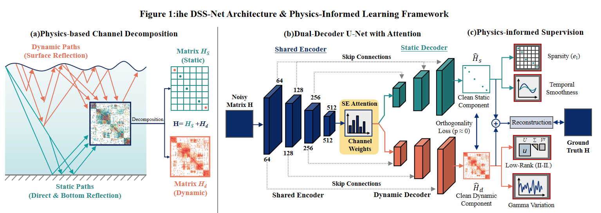

# DSS-Net: Dynamic-Static Separation Networks for UWA Channel Denoising

## 项目简介

本项目实现了 **DSS-Net (Dynamic-Static Separation Networks)**，一种基于物理启发的深度学习框架，用于水声（UWA）信道去噪。该方法通过将信道分解为静态分量和动态分量，结合物理约束的损失函数设计，显著提升了信道估计精度。

## 方法框架



DSS-Net采用**双解码器U-Net架构**，核心思想是将含噪信道分解为：
- **静态分量 (Static Component)**：来自稳定传播路径（直接路径、海底反射），具有稀疏性和时间稳定性
- **动态分量 (Dynamic Component)**：来自时变海面反射，具有低秩特性和快速时变性

### 核心创新

1. **动静态分解架构**：共享编码器 + 双对称解码器，显式分离两种分量
2. **物理启发损失函数**：
   - L1稀疏性约束（静态分量）
   - 核范数低秩约束（动态分量）
   - 时间相关性先验
   - 分离质量度量
3. **SE注意力机制**：Squeeze-and-Excitation模块增强特征选择

---

## 性能

### 仿真数据（Ray-Tracing）

| 方法 | NMSE (dB) | 提升 |
|------|-----------|------|
| 无处理 | -20.41 | - |
| U-Net Baseline | -23.49 | +3.08 |
| **DSS-Net (Ours)** | **-25.27** | **+4.86** |

### 海试数据（抚仙湖）

| 深度 | 去噪增益 | 估计SNR | 静态占比 | 动态占比 |
|------|---------|---------|---------|---------|
| 5m | 2.39 dB | 4.99 dB | 69.3% | 23.8% |
| 7m | 1.38 dB | 7.29 dB | 65.3% | 24.6% |
| 9m | 1.31 dB | 7.46 dB | 52.8% | 29.0% |

> **注**: 海试数据无ground truth，去噪增益 = 10*log10(输入功率/输出功率)，表示去除的噪声能量。

**物理规律验证**：深度增加 → 动态分量（海面反射）占比增大，符合声学传播原理。

---

## 项目结构

```
signal_dy_static/
├── dss_net/                       # 核心代码目录
│   ├── model.py                   # DSS-Net模型定义
│   ├── loss.py                    # 物理启发损失函数
│   ├── dataset.py                 # 数据加载器
│   ├── train.py                   # 训练脚本
│   ├── eval.py                    # 评估脚本
│   ├── eval_real_data.py          # 真实数据评估脚本
│   ├── config.yaml                # 主配置文件
│   └── results_20251104_092511/   # 实验结果目录
│
├── paper/                         # IEEE论文相关文件
│   ├── bare_jrnl_new_sample4.tex  # 论文LaTeX源码
│   └── bare_jrnl_new_sample4.pdf  # 论文PDF
│
├── sea_trial_data/                # 抚仙湖海试数据 (需单独下载)
├── data_utils/                    # 数据预处理工具
├── dss_net_architecture.png       # 方法框架图
└── README.md
```

---

## 快速开始

### 环境要求

```bash
pip install torch numpy scipy matplotlib pyyaml tqdm pandas
```

### 预训练模型下载

由于模型文件较大（~500MB），请从以下链接下载：

```
# TODO: 添加下载链接
```

下载后放置于：
```
dss_net/results_20251104_092511/full/.../checkpoints/best.pth
```

### 训练模型

```bash
cd dss_net

# 单GPU训练
python train.py --config config.yaml

# 多GPU训练 (DDP)
torchrun --nproc_per_node=4 train.py --config config.yaml
```

### 评估真实数据

```bash
cd dss_net
python eval_real_data.py \
    --checkpoint path/to/best.pth \
    --data_dir ../sea_trial_data \
    --output_dir ./real_data_results
```

---

## 模型说明

### 输入输出

- **输入**: 含噪信道 `H_noise` ∈ ℂ^(M×N) → 实数表示 [real, imag] ∈ ℝ^(2×M×N)
- **输出**:
  - `H_static`: 静态分量
  - `H_dynamic`: 动态分量  
  - `H_total = H_static + H_dynamic`: 去噪后信道

### 关键配置

```yaml
model:
  name: "UNetDecomposer"
  base_channels: 64
  depth: 4
  use_attention: true

loss:
  weights:
    static_mse: 1.0
    dynamic_mse: 2.0      # 动态分量更难估计
    total_mse: 3.0        # 总体重建最重要
  sparsity_lambda: 0.0001
  nuclear_lambda: 0.0001
  separation_weight: 0.05
```

---

## 论文引用

```bibtex
@article{yang2025dssnet,
  title={DSS-Net: Dynamic--Static Separation Networks for Physics-Inspired UWA Channel Denoising},
  author={Yang, Xiaoyu and Chen, Yinda and Tong, Feng and Zhou, Yuehai},
  journal={IEEE Transactions on Wireless Communications},
  year={2025}
}
```

---

## 联系方式

- 杨晓宇: xiaoyuyang@stu.xmu.edu.cn (信道建模、海试验证)
- 陈寅达: yindachen@mail.ustc.edu.cn (算法设计、代码实现)

---

## License

MIT License
